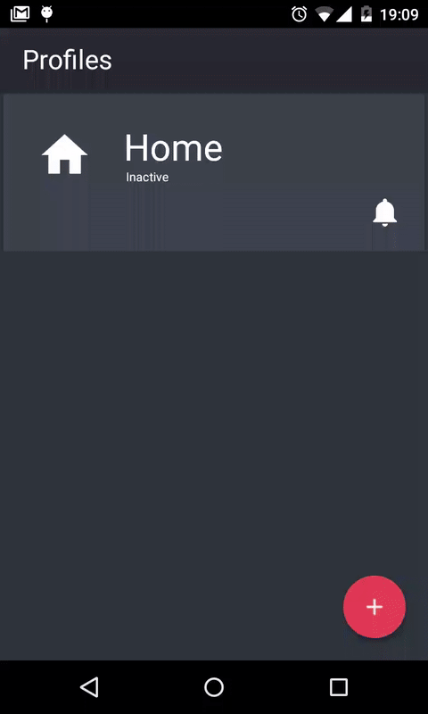

# CleanApp

This project demonstrates how to make complex Android application with good architecture

In project is used:
- [CleanArchitecture](https://8thlight.com/blog/uncle-bob/2012/08/13/the-clean-architecture.html) (simplifyed for Android)
- Simple MVP (how implement advanced MVP see [Ferro library](https://github.com/MaksTuev/ferro))
- [Dagger2](http://google.github.io/dagger/) 
- [RxJava](http://reactivex.io/)
- Сonvenient Structure Packages 

If you are not familiar with Dagger and MVP, I recommend first get acquainted with the less complex projects [link1] (https://github.com/grandstaish/hello-mvp-dagger-2) [link2](https://github.com/JorgeCastilloPrz/EasyMVP) [link3](http://antonioleiva.com/mvp-android/) 



This application can automatically change device settings when specified conditions is fulfilled and return previous settings when conditions ceases to be fulfilled


##Arhcitecture
The architecture is a simplified version of  [CleanArchitecture](https://8thlight.com/blog/uncle-bob/2012/08/13/the-clean-architecture.html).

The application divided into 4 layers:
- **Domain** - contains enterprise wide business rules, for most app this layer contains only core entities.
- **Interactor** - contains inner application's logic. This layer provides access to data storages and other services. Api of this layer should not depend on Android Framework and other libraries, besides infrastructural libraries like RxJava. Interactor layer consists of loosely bound modules, each of which has a well defined responsibility. Every module contains class, which provide access to functionality of this module. Other module classes, which contains details of the implementation, should not be used by other parts of application. Data objects, which are used by low-level storages, should be transformed to Domain layer's entities inside this layer. A module can be used by Presenter or by other module. 
- **Presenter** - contains screen's logic
- **View** - is responsible for interaction with the user

In most cases, each layer must depends on only previous layer and Domain layer. 

In this project interfaces for Interactor and View layers is not used, but if they need for tests or you want to create absolutely clean architecture, you can extract interfaces in AndroidStudio in two clicks.

##Structure Packages 
Structure packages is hybrid of package-by-layer and package-by-feature styles. It have a special significance as far as defining the basic architecture and determines the way of thinking of developer.


Root package contains five subpackages
- **app** - contains the application class and other classes which is corresponding context of all applications (such as dagger application-level component)
- **domain** - corresponds to Domain layer. If some entities is logically coupled, it should be placed inside appropriate subpackage.
- **interactor** - corresponds to Interactor layer. Every module of this layer is placed inside appropriate subpackage. This package can also contains 'common' subpackage with classes, which are used by several modules 
- **ui** - corresponds to Presenter and View layers. It contains four subpackages: 
  - **base** - contains base classes for View, Presenter, Dialog etc.
  - **screen** - each screen placed inside corresponding subpackges. This subpackage can contains View, Presenter, Dagger screen component, Dagger screen module, Adapters, ViewHolders, custom android.Views etc. If some of this classes is logically coupled, they should be placed inside appropriate subpackage. If some of screens is logically coupled, they should be placed inside appropriate subpackage inside screen package.
  - **common** - contains classes, which are used by several screens.
  - **util** - contains util classes, which are used only inside Presenter/View layers.
- **util** - util classes, which are used throughout the application.

Next example demonstrate how organize classes in Interactor layer's module.

For exmple you need create module for obtaining books from server or from cache. Then package for this module can look like this:
- **book** - is root module package, it contains BookRepository class, Dagger module and next subpackges:
  - **network** - contains api interface for retrofit and subpackages:
    - **response** - contains responce objects
    - **request** - contains request objects
  - **cache** - contains all classes, which is nessasry for book's cache, e.g. BookDao
  
BookRepository should transform objects which came from server and cache to the Book entity.

## License
```
Copyright 2016 Maxim Tuev

   Licensed under the Apache License, Version 2.0 (the "License");
   you may not use this file except in compliance with the License.
   You may obtain a copy of the License at

       http://www.apache.org/licenses/LICENSE-2.0

   Unless required by applicable law or agreed to in writing, software
   distributed under the License is distributed on an "AS IS" BASIS,
   WITHOUT WARRANTIES OR CONDITIONS OF ANY KIND, either express or implied.
   See the License for the specific language governing permissions and
   limitations under the License.
```

